

<picture>
  <source media="(max-width: 560px)" srcset="./assets/matrix-v8/hero-mobile.svg" />
  <source media="(max-width: 1000px)" srcset="./assets/matrix-v8/hero-tablet.svg" />
  
</picture>

<picture>
  <source media="(max-width: 560px)" srcset="./assets/matrix-v8/identity-mobile.svg" />
  <source media="(max-width: 1000px)" srcset="./assets/matrix-v8/identity-tablet.svg" />
  
</picture>

  <a href="https://github.com/hemkesh2021-dotcom?tab=repositories">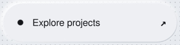</a>
  &nbsp;
  <a href="https://www.linkedin.com/in/hemkesh-r-461532322/">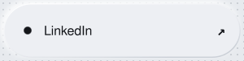</a>

<picture>
  <source media="(max-width: 560px)" srcset="./assets/matrix-v8/divider-cyan-mobile.svg" />
  <source media="(max-width: 1000px)" srcset="./assets/matrix-v8/divider-cyan-tablet.svg" />
  
</picture>

<picture>
  <source media="(max-width: 560px)" srcset="./assets/matrix-v8/build-mobile.svg" />
  <source media="(max-width: 1000px)" srcset="./assets/matrix-v8/build-tablet.svg" />
  
</picture>

<picture>
  <source media="(max-width: 560px)" srcset="./assets/matrix-v8/divider-orange-mobile.svg" />
  <source media="(max-width: 1000px)" srcset="./assets/matrix-v8/divider-orange-tablet.svg" />
  
</picture>

<picture>
  <source media="(max-width: 560px)" srcset="./assets/matrix-v8/stack-mobile.svg" />
  <source media="(max-width: 1000px)" srcset="./assets/matrix-v8/stack-tablet.svg" />
  
</picture>

<picture>
  <source media="(max-width: 560px)" srcset="./assets/matrix-v8/divider-cyan-mobile.svg" />
  <source media="(max-width: 1000px)" srcset="./assets/matrix-v8/divider-cyan-tablet.svg" />
  
</picture>

<picture>
  <source media="(max-width: 560px)" srcset="./assets/matrix-v8/path-mobile.svg" />
  <source media="(max-width: 1000px)" srcset="./assets/matrix-v8/path-tablet.svg" />
  
</picture>

<picture>
  <source media="(max-width: 560px)" srcset="./assets/matrix-v8/divider-orange-mobile.svg" />
  <source media="(max-width: 1000px)" srcset="./assets/matrix-v8/divider-orange-tablet.svg" />
  
</picture>

<picture>
  <source media="(max-width: 560px)" srcset="./assets/matrix-v8/systems-mobile.svg" />
  <source media="(max-width: 1000px)" srcset="./assets/matrix-v8/systems-tablet.svg" />
  
</picture>

<picture>
  <source media="(max-width: 560px)" srcset="./assets/matrix-v8/divider-cyan-mobile.svg" />
  <source media="(max-width: 1000px)" srcset="./assets/matrix-v8/divider-cyan-tablet.svg" />
  
</picture>

<a href="https://github.com/hemkesh2021-dotcom/AEGIS-complaint-resolution">
<picture>
  <source media="(max-width: 560px)" srcset="./assets/matrix-v8/aegis-mobile.svg" />
  <source media="(max-width: 1000px)" srcset="./assets/matrix-v8/aegis-tablet.svg" />
  
</picture>
</a>

<picture>
  <source media="(max-width: 560px)" srcset="./assets/matrix-v8/aegis-engineering-details-mobile.svg" />
  <source media="(max-width: 1000px)" srcset="./assets/matrix-v8/aegis-engineering-details-tablet.svg" />
  
</picture>

<picture>
  <source media="(max-width: 560px)" srcset="./assets/matrix-v8/divider-orange-mobile.svg" />
  <source media="(max-width: 1000px)" srcset="./assets/matrix-v8/divider-orange-tablet.svg" />
  
</picture>

<a href="https://github.com/hemkesh2021-dotcom/Sentinel_Surveillance">
<picture>
  <source media="(max-width: 560px)" srcset="./assets/matrix-v8/sentinel-mobile.svg" />
  <source media="(max-width: 1000px)" srcset="./assets/matrix-v8/sentinel-tablet.svg" />
  
</picture>
</a>

<picture>
  <source media="(max-width: 560px)" srcset="./assets/matrix-v8/sentinel-overview-details-mobile.svg" />
  <source media="(max-width: 1000px)" srcset="./assets/matrix-v8/sentinel-overview-details-tablet.svg" />
  
</picture>

<picture>
  <source media="(max-width: 560px)" srcset="./assets/matrix-v8/sentinel-prototype-mobile.svg" />
  <source media="(max-width: 1000px)" srcset="./assets/matrix-v8/sentinel-prototype-tablet.svg" />
  
</picture>

<picture>
  <source media="(max-width: 560px)" srcset="./assets/matrix-v8/sentinel-prototype-details-mobile.svg" />
  <source media="(max-width: 1000px)" srcset="./assets/matrix-v8/sentinel-prototype-details-tablet.svg" />
  
</picture>

<picture>
  <source media="(max-width: 560px)" srcset="./assets/matrix-v8/sentinel-deployment-mobile.svg" />
  <source media="(max-width: 1000px)" srcset="./assets/matrix-v8/sentinel-deployment-tablet.svg" />
  
</picture>

<picture>
  <source media="(max-width: 560px)" srcset="./assets/matrix-v8/sentinel-deployment-details-mobile.svg" />
  <source media="(max-width: 1000px)" srcset="./assets/matrix-v8/sentinel-deployment-details-tablet.svg" />
  
</picture>

<picture>
  <source media="(max-width: 560px)" srcset="./assets/matrix-v8/sentinel-improvement-mobile.svg" />
  <source media="(max-width: 1000px)" srcset="./assets/matrix-v8/sentinel-improvement-tablet.svg" />
  
</picture>

<picture>
  <source media="(max-width: 560px)" srcset="./assets/matrix-v8/sentinel-improvement-details-mobile.svg" />
  <source media="(max-width: 1000px)" srcset="./assets/matrix-v8/sentinel-improvement-details-tablet.svg" />
  
</picture>

<picture>
  <source media="(max-width: 560px)" srcset="./assets/matrix-v8/sentinel-v2-mobile.svg" />
  <source media="(max-width: 1000px)" srcset="./assets/matrix-v8/sentinel-v2-tablet.svg" />
  
</picture>

<picture>
  <source media="(max-width: 560px)" srcset="./assets/matrix-v8/sentinel-v2-details-mobile.svg" />
  <source media="(max-width: 1000px)" srcset="./assets/matrix-v8/sentinel-v2-details-tablet.svg" />
  
</picture>

<picture>
  <source media="(max-width: 560px)" srcset="./assets/matrix-v8/divider-cyan-mobile.svg" />
  <source media="(max-width: 1000px)" srcset="./assets/matrix-v8/divider-cyan-tablet.svg" />
  
</picture>

<picture>
  <source media="(max-width: 560px)" srcset="./assets/matrix-v8/signal-mobile.svg" />
  <source media="(max-width: 1000px)" srcset="./assets/matrix-v8/signal-tablet.svg" />
  
</picture>

<picture>
  <source media="(max-width: 560px)" srcset="./assets/matrix-v8/divider-orange-mobile.svg" />
  <source media="(max-width: 1000px)" srcset="./assets/matrix-v8/divider-orange-tablet.svg" />
  
</picture>

<picture>
  <source media="(max-width: 560px)" srcset="./assets/matrix-v8/interests-mobile.svg" />
  <source media="(max-width: 1000px)" srcset="./assets/matrix-v8/interests-tablet.svg" />
  
</picture>

<picture>
  <source media="(max-width: 560px)" srcset="./assets/matrix-v8/footer-mobile.svg" />
  <source media="(max-width: 1000px)" srcset="./assets/matrix-v8/footer-tablet.svg" />
  
</picture>
