  

  
  &nbsp;
  

## `$ whoami`

I am **Hemkesh**, a final-year B.Tech Computer Science Engineering student at **Dayananda Sagar University**, graduating in **2027**.

I build intelligent systems across generative AI, edge inference, computer vision, full-stack services, and systems engineering. My work emphasizes grounded outputs, local-first execution, measurable evaluation, security, and software that remains useful outside a demo environment.

- **Primary direction:** Generative AI, LLM applications, RAG, and agentic systems
- **Engineering depth:** Edge AI, computer vision, backend services, data systems, and deployment
- **Current experience:** Freelance AI/ML Model Evaluator at Deccan AI — Apr 2026 to present
- **Current status:** Student · open to full-time Software Engineering and AI/ML roles

> **Software, intelligence, and systems—built to work.**

## `$ focus --current`

| Generative AI systems | Edge intelligence | Production-oriented software |
|---|---|---|
| Agent workflows, hybrid retrieval, grounded generation, evaluation, and human approval paths | TensorRT computer vision, local multimodal models, constrained-memory deployment, and real-time inference | Java and Python services, full-stack interfaces, PostgreSQL, containers, security, and observability |

## `$ stack --matrix`

| Area | Technologies |
|---|---|
| Languages | `Python` · `Java` · `C` · `TypeScript` |
| AI and ML | `LLMs` · `RAG` · `Computer Vision` · `Machine Learning` · `TensorRT` |
| Web and services | `Next.js` · `React` · `FastAPI` · `Spring Boot` · `Flask` |
| Infrastructure and data | `Docker` · `Cloud` · `PostgreSQL` · `pgvector` · `NVIDIA Jetson` |

## `$ systems --featured`

### 01 — [AEGIS](https://github.com/hemkesh2021-dotcom/AEGIS-complaint-resolution) `COMPLETED`

**Agentic banking complaint resolution that verifies AI-generated responses before they reach customers.**

AEGIS uses a Spring Boot Java 21 orchestrator to run a seven-stage pipeline:

`ingest → classify → compliance → retrieve → draft → verify → audit`

- DistilBERT complaint classification with local inference and deterministic fallback
- Hybrid pgvector semantic retrieval plus BM25 keyword retrieval
- NVIDIA NIM drafting with a deterministic template-engine fallback
- Grounding gates that block invented figures, contacts, and template debris
- PII redaction, OIDC roles, maker-checker approval, rate limits, and append-only audit history
- Human edits become labelled feedback through an exportable learning loop

**Verified engineering signals:** `77.3% temporal-holdout accuracy` · `p95 774 ms pipeline latency` · `~63 requests/s measured`

`Java 21` · `Spring Boot` · `Python` · `DistilBERT` · `FastAPI` · `RAG` · `pgvector` · `NVIDIA NIM` · `Docker`

---

### 02 — [SENTINEL](https://github.com/hemkesh2021-dotcom/Sentinel_Surveillance) `PROTOTYPE COMPLETE · IMPROVEMENTS ONGOING`

**Self-hosted edge-AI surveillance for NVIDIA Jetson: detect, identify, understand, and alert locally in real time.**

`RTSP camera → detection and tracking → face recognition → local VLM analysis → dashboard and alerts`

#### Completed prototype

- YOLOv8n TensorRT person detection with ByteTrack tracking
- DeepFace, Facenet512, and YuNet face recognition with session Re-ID
- LFM2-VL 1.6B scene understanding through GPU-accelerated llama.cpp
- Fully local inference with no cloud dependency for vision or scene analysis
- Fire/smoke, threat, stranger, restricted-hours, entry/exit, and alert workflows
- Authenticated Flask dashboard with live stream, event log, and camera-aware AI chat
- Telegram alert snapshots with priority-aware cooldowns
- Tested on an NVIDIA Jetson Orin Nano Super with 8 GB unified memory and an ONVIF/RTSP camera

#### Deployment engineering

- Uses `GGML_CUDA_ENABLE_UNIFIED_MEMORY=1` so the VLM can run on Jetson's shared CPU/GPU memory pool
- Starts headless, launches the VLM first, and then starts the surveillance engine and dashboard
- Separates `llama-server`, the Python inference engine, and the Flask dashboard into three processes
- Exchanges frames and state atomically to prevent torn dashboard reads

#### Active improvement process

- Reduce and enforce memory usage below the project cap
- Improve runtime reliability, camera reconnection, and long-running observability
- Harden authentication, transport security, secrets handling, and deployment defaults
- Expand PTZ patrol, tracking, and persistent home-position behavior
- Upgrade the responsive web experience and prepare Android/iOS client support

`Python` · `YOLOv8n TensorRT` · `ByteTrack` · `DeepFace` · `LFM2-VL 1.6B` · `llama.cpp` · `Flask` · `NVIDIA Jetson`

---

### 03 — ARIA `WIP · ACTIVE BUILD`

**Local-first multimodal AI assistant combining private intelligence, automation, and edge surveillance.**

- Private-by-default orchestration with cloud escalation only for heavier workloads
- Persistent cross-device memory and tool-aware assistant workflows
- One local intelligence layer spanning assistant, automation, and surveillance contexts
- Designed for Jetson-class edge hardware and full desktop environments

`Python` · `FastAPI` · `LLMs + RAG` · `NVIDIA Jetson` · `NVIDIA NIM` · `React / Next.js` · `Docker` · `PostgreSQL / pgvector`

## `$ github --signal`

  <picture>
    <source media="(prefers-color-scheme: dark)" srcset="https://github-readme-stats.vercel.app/api?username=hemkesh2021-dotcom&amp;show_icons=true&amp;hide_border=true&amp;bg_color=00000000&amp;title_color=00B4D8&amp;text_color=8B949E&amp;icon_color=FF6B00" />
    
  </picture>
  <picture>
    <source media="(prefers-color-scheme: dark)" srcset="https://github-readme-stats.vercel.app/api/top-langs/?username=hemkesh2021-dotcom&amp;layout=compact&amp;hide_border=true&amp;bg_color=00000000&amp;title_color=00B4D8&amp;text_color=8B949E" />
    
  </picture>

  <picture>
    <source media="(prefers-color-scheme: dark)" srcset="https://streak-stats.demolab.com?user=hemkesh2021-dotcom&amp;hide_border=true&amp;background=00000000&amp;ring=00B4D8&amp;fire=FF6B00&amp;currStreakLabel=00B4D8&amp;sideNums=E6EDF3&amp;currStreakNum=E6EDF3&amp;sideLabels=8B949E&amp;dates=6E7781" />
    
  </picture>

  <picture>
    <source media="(prefers-color-scheme: dark)" srcset="https://github-profile-trophy.vercel.app/?username=hemkesh2021-dotcom&amp;theme=onedark&amp;no-frame=true&amp;no-bg=true&amp;margin-w=8&amp;column=6" />
    
  </picture>

## `$ interests`

`Local-first AI` · `Edge AI` · `Intelligent systems` · `Systems engineering` · `Computer vision` · `Robotics` · `Open-source engineering` · `Cloud-native development`

---

  <code>&gt; build_status: curious / shipping / learning</code>

