

<picture>
  <source media="(max-width: 680px)" srcset="./assets/beige-v6/hero-mobile.svg" />
  
</picture>

<picture>
  <source media="(max-width: 680px)" srcset="./assets/beige-v6/identity-mobile.svg" />
  
</picture>

  <a href="https://github.com/hemkesh2021-dotcom?tab=repositories"></a>
  &nbsp;
  <a href="https://www.linkedin.com/in/hemkesh-r-461532322/"></a>

<picture>
  <source media="(max-width: 680px)" srcset="./assets/beige-v6/divider-cyan-mobile.svg" />
  
</picture>

<picture>
  <source media="(max-width: 680px)" srcset="./assets/beige-v6/build-mobile.svg" />
  
</picture>

<picture>
  <source media="(max-width: 680px)" srcset="./assets/beige-v6/divider-orange-mobile.svg" />
  
</picture>

<picture>
  <source media="(max-width: 680px)" srcset="./assets/beige-v6/stack-mobile.svg" />
  
</picture>

<picture>
  <source media="(max-width: 680px)" srcset="./assets/beige-v6/divider-cyan-mobile.svg" />
  
</picture>

<picture>
  <source media="(max-width: 680px)" srcset="./assets/beige-v6/path-mobile.svg" />
  
</picture>

<picture>
  <source media="(max-width: 680px)" srcset="./assets/beige-v6/divider-orange-mobile.svg" />
  
</picture>

<picture>
  <source media="(max-width: 680px)" srcset="./assets/beige-v6/systems-mobile.svg" />
  
</picture>

<picture>
  <source media="(max-width: 680px)" srcset="./assets/beige-v6/divider-cyan-mobile.svg" />
  
</picture>

<a href="https://github.com/hemkesh2021-dotcom/AEGIS-complaint-resolution">
<picture>
  <source media="(max-width: 680px)" srcset="./assets/beige-v6/aegis-mobile.svg" />
  
</picture>
</a>

<picture>
  <source media="(max-width: 680px)" srcset="./assets/beige-v6/aegis-engineering-details-mobile.svg" />
  
</picture>

<picture>
  <source media="(max-width: 680px)" srcset="./assets/beige-v6/divider-orange-mobile.svg" />
  
</picture>

<a href="https://github.com/hemkesh2021-dotcom/Sentinel_Surveillance">
<picture>
  <source media="(max-width: 680px)" srcset="./assets/beige-v6/sentinel-mobile.svg" />
  
</picture>
</a>

<picture>
  <source media="(max-width: 680px)" srcset="./assets/beige-v6/sentinel-overview-details-mobile.svg" />
  
</picture>

<picture>
  <source media="(max-width: 680px)" srcset="./assets/beige-v6/sentinel-prototype-mobile.svg" />
  
</picture>

<picture>
  <source media="(max-width: 680px)" srcset="./assets/beige-v6/sentinel-prototype-details-mobile.svg" />
  
</picture>

<picture>
  <source media="(max-width: 680px)" srcset="./assets/beige-v6/sentinel-deployment-mobile.svg" />
  
</picture>

<picture>
  <source media="(max-width: 680px)" srcset="./assets/beige-v6/sentinel-deployment-details-mobile.svg" />
  
</picture>

<picture>
  <source media="(max-width: 680px)" srcset="./assets/beige-v6/sentinel-improvement-mobile.svg" />
  
</picture>

<picture>
  <source media="(max-width: 680px)" srcset="./assets/beige-v6/sentinel-improvement-details-mobile.svg" />
  
</picture>

<picture>
  <source media="(max-width: 680px)" srcset="./assets/beige-v6/divider-cyan-mobile.svg" />
  
</picture>

<picture>
  <source media="(max-width: 680px)" srcset="./assets/beige-v6/aria-lamp-mobile.svg" />
  
</picture>

<picture>
  <source media="(max-width: 680px)" srcset="./assets/beige-v6/aria-illuminated-details-mobile.svg" />
  
</picture>

<picture>
  <source media="(max-width: 680px)" srcset="./assets/beige-v6/divider-orange-mobile.svg" />
  
</picture>

<picture>
  <source media="(max-width: 680px)" srcset="./assets/beige-v6/signal-mobile.svg" />
  
</picture>

<picture>
  <source media="(max-width: 680px)" srcset="./assets/beige-v6/divider-cyan-mobile.svg" />
  
</picture>

<picture>
  <source media="(max-width: 680px)" srcset="./assets/beige-v6/interests-mobile.svg" />
  
</picture>

<picture>
  <source media="(max-width: 680px)" srcset="./assets/beige-v6/footer-mobile.svg" />
  
</picture>
